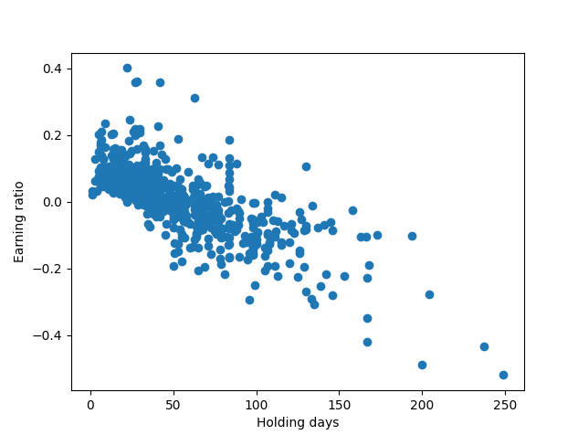
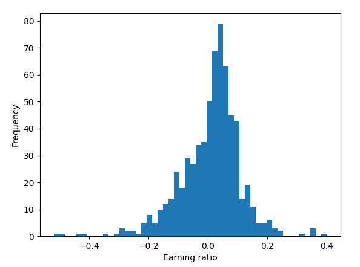
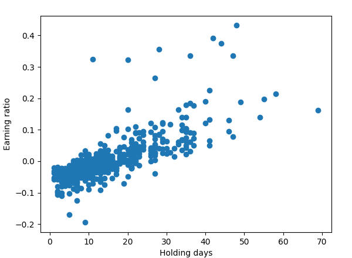
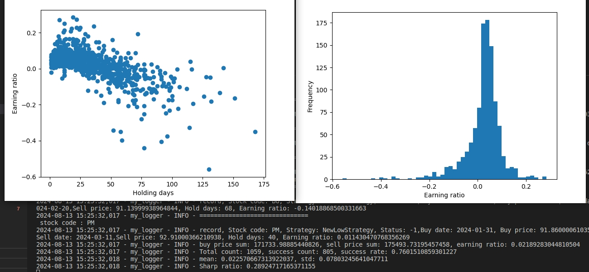
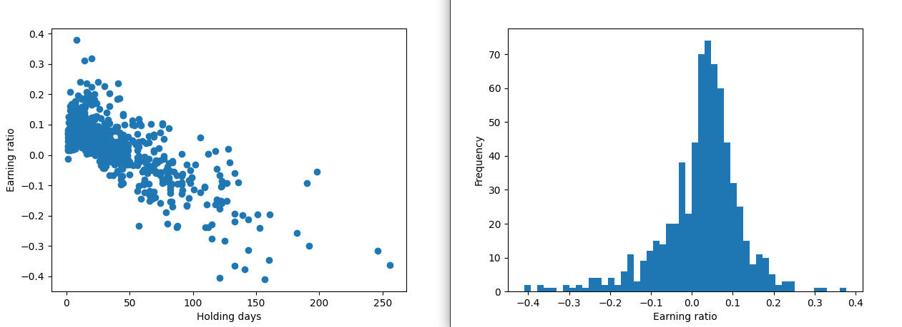
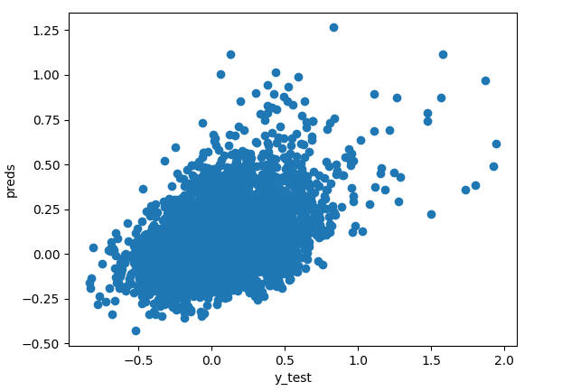
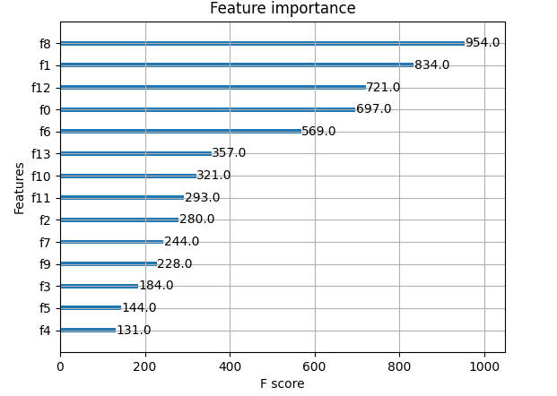

hs300
startDate = "2020-01-01"
endDate = "2024-07-15"
## 1. cci
```python
class CCIStrategy(StragegyTemplate):
    params = (('cci_period', 15), ('cci_upper', 150), ('cci_lower', -150), ('high_period', 20),)
    def __init__(self):
        super().__init__()
        self.cci = bt.indicators.CCI(self.datas[0], period=self.params.cci_period)
        self.high = bt.indicators.Highest(self.datas[0].high, period=self.params.high_period)
        
    def next(self):
        change = self.dataclose[0] - self.dataclose[-1]
        change_percent = change / self.dataclose[-1] * 100
        # self.log("Close: %.2f, CCI: %.2f, Change percent: %.2f" % (self.dataclose[0], self.cci[0], change_percent) )
        # check if there is an unfinished order
        if self.order:
            return

        # check if in the market
        if self.position.size > 0:
            # if the CCI is above the upper bound, sell
            if self.cci[0] < self.params.cci_upper and self.cci[-1] >= self.params.cci_upper:
                self.order = self.sell()
            # elif self.dataclose[0] < self.high[-1] * 0.80:
            #     self.order = self.sell()
                
        else:
            # if the CCI is below the lower bound, buy
            if self.cci[0] > self.params.cci_lower and self.cci[-1] <= self.params.cci_lower:
                self.order = self.buy()
```
result：
```
Total gain: 171035.88855302427
217 / 299 acc: 0.725752508361204
```

## 2. new high
```python
class NewHighStrategy(StragegyTemplate):
    params = (
        ('window', 20),
        ('ema_period', 50),
        ('ema_sell_period', 50)
    )

    def __init__(self):
        super().__init__()
        self.high = bt.indicators.Highest(self.datas[0].high, period=self.params.window)
        self.low = bt.indicators.Lowest(self.datas[0].low, period=self.params.window)
        self.ema = bt.indicators.ExponentialMovingAverage(self.datas[0], period=self.params.ema_period)
        self.sell_ema = bt.indicators.ExponentialMovingAverage(self.datas[0], period=self.params.ema_sell_period)

    def next(self):
        if self.order:
            return

        if not self.position:  # not in the market
            if self.dataclose[0] > self.high[-1] and self.dataclose[0] > self.ema[0]:
                self.order = self.buy()
        else:  # in the market
            if self.dataclose[0] < self.low[-1] or self.dataclose[0] < self.high[-1] * (1 - 0.20) or self.dataclose[0] < self.sell_ema[0]:
                self.order = self.sell()

```

```txt
Total gain: 163876.14867420745
163 / 300 acc: 0.5433333333333333
```

compare the two strategies, the cci strategy has a higher accuracy and total gain. but the new high strategy has a lower accuracy and get higher average profit per trade, and new high strategy has a shorter holding period.

## 3. rsi

```python

class RSIStrategy(StragegyTemplate):
    params = (('rsi_period', 15), ('rsi_upper', 70), ('rsi_lower', 30),('high_period', 20),('stop_loss', 0.2))
    def __init__(self):
        super().__init__()
        self.min_price = 0.0
        self.rsi = bt.indicators.RSI(self.datas[0].close, period=self.params.rsi_period)
        self.highest = bt.indicators.Highest(self.datas[0].high, period=self.params.high_period)
        
    def next(self):
        change = self.dataclose[0] - self.dataclose[-1]
        change_percent = change / self.dataclose[-1] * 100
        # self.log("Close: %.2f, RSI: %.2f, Change percent: %.2f" % (self.dataclose[0], self.rsi[0], change_percent) )
        # check if there is an unfinished order
        if self.order:
            return

        # check if in the market
        if self.position.size > 0:
            # if the RSI is above the upper bound, sell
            if self.rsi[0] <= self.params.rsi_upper and self.rsi[-1] > self.params.rsi_upper:
                self.order = self.sell()
            # elif self.dataclose[0] < self.highest[-1] * (1 - self.params.stop_loss):
            #     self.order = self.sell()
            
        else:
            # if the RSI is below the lower bound, buy
            if self.rsi[0] >= self.params.rsi_lower and self.rsi[-1] < self.params.rsi_lower:
                self.order = self.buy()
```

```txt
Total gain: 63572.84902108788
169 / 298 acc: 0.5671140939597316
```

## 4. new low
```python
class NewLowStrategy(StragegyTemplate):
    params = (
        ('highest_window', 15),
        ('lowest_window', 25),
        ('ema_period', 20),
        ('ema_sell_period', 10)
    )

    def __init__(self):
        super().__init__()
        self.high = []
        self.low = []
        self.ema = []
        self.ema_sell = []
        for i, data in enumerate(self.datas):
            self.high.append(bt.indicators.Highest(data.high, period=self.params.highest_window))
            self.low.append(bt.indicators.Lowest(data.low, period=self.params.lowest_window))
            self.ema.append(bt.indicators.ExponentialMovingAverage(data.close, period=self.params.ema_period))
            self.ema_sell.append(bt.indicators.ExponentialMovingAverage(data.close, period=self.params.ema_sell_period))

    def next(self):
        if self.order:
            return

        for i, data in enumerate(self.datas):
            if self.getposition(data).size <= 0 :
                if data.close[0] < self.low[i][-1] :
                    print(f"{data.datetime.date(0)}: name : {data._name} buy , today coloe at {data.close[0]}")
                    self.order = self.buy(data)
            else:
                hold_days = (data.datetime.date(0) - self.hold_pool.get_record(data._name).buy_date).days
                if data.close[0] > self.high[i][-1] :
                    print(f"{data.datetime.date(0)}: name : {data._name} sell , today close at {data.close[0]}")
                    self.order = self.sell(data)
```

```txt
2024-07-23 17:36:53,757 - my_logger - INFO - buy price sum: 29627.29852567998, sell price sum: 29799.069204409996, earning ratio: 0.005797716541085599
2024-07-23 17:36:53,757 - my_logger - INFO - Total count: 654, success count: 407, success rate: 0.6223241590214067
2024-07-23 17:36:53,758 - my_logger - INFO - Sharp ratio: 0.09097891154979973
Final Portfolio Value: 99275.08
Sharpe Ratio: OrderedDict([('sharperatio', -0.6921269346939204)])
max Draw Down: AutoOrderedDict([('len', 159), ('drawdown', 1.4656624604966713), ('moneydown', 1466.5450536732533)])
return: -0.16699293299743187
```
Buy stocks that hit a 25-day low, and sell when the stock price exceeds the highest price within 15 days. Among the stocks that can be sold within 1-10 days, there are hardly any losses, but as the trigger time gets longer, the returns get lower, and they are basically losses, with high credibility. The point that needs to be further explored is how to find those stocks that can be triggered in a short time, add judgments of other indicators, and screen these out.

Conversely, for stocks that hit new highs, those that end in the short term are basically losses, and as time increases, the returns become higher. Among the stocks in the hs300, the medium-term momentum effect is more obvious, and the short-term reversal effect is more pronounced.

- new low 
  
  
- new low hist
  
  

- new high
  
  


### for sp500


```txt
2024-08-16 11:20:46,824 - my_logger - INFO - Total count: 6155, success count: 4187, success rate: 0.680259951259139
2024-08-16 11:20:46,826 - my_logger - INFO - mean: 0.021284684869758642, std: 0.10618461896335184
2024-08-16 11:20:46,826 - my_logger - INFO - Sharp ratio: 0.2004497928000736
Final Portfolio Value: 1017282.87
Sharpe Ratio: OrderedDict([('sharperatio', 1.0452349681066784)])
max Draw Down: AutoOrderedDict([('len', 175), ('drawdown', 1.8475848927270107), ('moneydown', 18493.5255269584)])
return: 0.40627620367840445
```

## 5. new low finetune
```python
class NewLowStrategy(StragegyTemplate):
    params = (
        ('highest_window', 15),
        ('lowest_window', 25),
        ('ema_period', 5),
        ('ema_sell_period', 10)
    )

    def __init__(self):
        super().__init__()
        self.high = []
        self.low = []
        self.ema = []
        self.ema_sell = []
        for i, data in enumerate(self.datas):
            self.high.append(bt.indicators.Highest(data.high, period=self.params.highest_window))
            self.low.append(bt.indicators.Lowest(data.low, period=self.params.lowest_window))
            self.ema.append(bt.indicators.ExponentialMovingAverage(data.close, period=self.params.ema_period))
            self.ema_sell.append(bt.indicators.ExponentialMovingAverage(data.close, period=self.params.ema_sell_period))

    def next(self):
        if self.order:
            return

        for i, data in enumerate(self.datas):
            if self.getposition(data).size <= 0 :
                if self.low[i][0] < self.low[i][-1] and data.close[0] > data.open[0] and data.close[0] > self.ema[i][0] :
                    print(f"{data.datetime.date(0)}: name : {data._name} buy , today coloe at {data.close[0]}")
                    self.order = self.buy(data)
            else:
                # hold_days = (data.datetime.date(0) - self.hold_pool.get_record(data._name).buy_date).days
                if data.close[0] > self.high[i][-1] :
                    print(f"{data.datetime.date(0)}: name : {data._name} sell , today close at {data.close[0]}")
                    self.order = self.sell(data)
```
  new low us sp 500
    

```txt
2024-08-13 15:25:32,017 - my_logger - INFO - Total count: 1059, success count: 805, success rate: 0.7601510859301227
2024-08-13 15:25:32,018 - my_logger - INFO - mean: 0.022570667313922037, std: 0.07803245641047711
2024-08-13 15:25:32,018 - my_logger - INFO - Sharp ratio: 0.28924717165371155
Final Portfolio Value: 1003403.58
Sharpe Ratio: OrderedDict([('sharperatio', 2.1323270329065003)])
max Draw Down: AutoOrderedDict([('len', 182), ('drawdown', 0.1749825330703401), ('moneydown', 1754.0058324934216)])
return: 0.08043108874514604
```
amazing, the new low strategy in the us sp 500 index companies has a high success rate and sharp ratio, and the return is 0.0804, the max draw down is 0.1749, sharp ratio is 2.13.


for hz300



```txt
2024-08-16 11:31:06,492 - my_logger - INFO - Total count: 675, success count: 475, success rate: 0.7037037037037037
2024-08-16 11:31:06,492 - my_logger - INFO - mean: 0.0224919307791907, std: 0.097833968848467
2024-08-16 11:31:06,492 - my_logger - INFO - Sharp ratio: 0.22989899156629312
Final Portfolio Value: 999801.19
Sharpe Ratio: OrderedDict([('sharperatio', -0.1501450230052196)])
max Draw Down: AutoOrderedDict([('len', 236), ('drawdown', 0.07299242761019854), ('moneydown', 730.3122297455557)])
return: -0.005045798765825489
```

## 6. xgboost regression
```
0 / MA5
1 / MA30
2 / RSI
3 / CCI
4 / slowk
5 / slowd
6 / ADX
7 / MOM
8 / OBV
9 / macd
10 / signal
11 / hist
12 / ATR
13 / ROC
use indictors:['ma5','ma30','rsi','cci','obv',....]

future 30 days reutrn as target
```


IC: 0.2734895863124457

as the result, the xgboost regressor can predict the future 30 days return with a IC of 0.2735, which is a good result.But it isn ot a good for A stock market.


